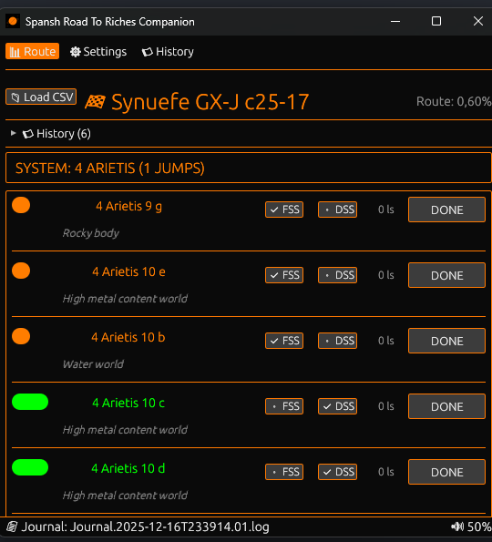

# 🚀 Elite Dangerous: Road to Riches Companion

**Select Language / Sprache wählen:**
- [English](#-english-version)
- [Deutsch](#-deutsche-version)

---

## 🇬🇧 English Version

The **Road to Riches Companion Tool** is your interactive assistant for exploration in Elite Dangerous. It monitors your journal logs in real-time to help you complete your route efficiently.

### 🚀 Prerequisite
This tool requires a route generated by the **[Spansh Road to Riches Plotter](https://spansh.co.uk/riches)**.
1. Generate a route on Spansh.
2. Export it as **CSV**.
3. Load the CSV file in the tool using the "Load CSV" button.

### ✨ Features
*   **Live Tracking:** Automatically detects when you scan a body using the FSS (Full Spectrum System Scanner) or DSS (Detailed Surface Scanner).
*   **Visual Feedback:**
    *   🟠 **Orange:** FSS Scan complete (Discovered).
    *   🟢 **Green:** DSS Map complete (Mapped & Done).
*   **Audio Feedback:** Plays confirmation sounds. **You can configure separate custom sounds (MP3/WAV) for FSS and DSS events in the settings.**
*   **History & Earnings:** The "History" tab lists your completed systems and provides an **estimate of earned credits** 💰.
*   **Navigation:** Click on the system name to copy it to your clipboard.
*   **Design:** Full Dark Mode theme matching the Elite Dangerous HUD style.

### 🛠 Installation
1. Download the latest binary from Releases.
2. Extract the ZIP archive.
3. **Windows:** Run `roadtoriches.exe`.
4. **Linux:** Run `chmod +x roadtoriches` and start it with `./roadtoriches`.

---

## 🇩🇪 Deutsche Version

Das **Road to Riches Companion Tool** ist dein interaktiver Begleiter für die Erkundung in Elite Dangerous. Es überwacht deine Journal-Logs in Echtzeit und hilft dir, deine Route effizient abzuarbeiten.

### 🚀 Voraussetzung
Dieses Tool benötigt eine Route, die mit dem **[Spansh Road to Riches Plotter](https://spansh.co.uk/riches)** erstellt wurde.
1. Erstelle eine Route auf Spansh.
2. Exportiere sie als **CSV**.
3. Lade die CSV-Datei im Tool über den Button "CSV laden".

### ✨ Funktionen
*   **Live-Tracking:** Erkennt automatisch, wenn du einen Planeten mit dem FSS (Full Spectrum System Scanner) oder DSS (Detailed Surface Scanner) scannst.
*   **Visuelles Feedback:**
    *   🟠 **Orange:** FSS Scan erledigt (Entdeckt).
    *   🟢 **Grün:** DSS Map erledigt (Kartografiert & Fertig).
*   **Audio-Feedback:** Spielt Bestätigungstöne ab. **Du kannst in den Einstellungen separate Sound-Dateien (MP3/WAV) für FSS- und DSS-Scans hinterlegen.**
*   **Verlauf & Credits:** Der Tab "Verlauf" zeigt deine abgeschlossenen Systeme und eine **Schätzung der verdienten Credits** 💰.
*   **Navigation:** Klicke auf den Systemnamen, um ihn in die Zwischenablage zu kopieren.
*   **Design:** Vollständiges Dark-Mode Theme im Stil des Elite Dangerous HUDs.

### 🛠 Installation
1. Lade die aktuelle Version unter Releases herunter.
2. Entpacke das ZIP-Archiv.
3. **Windows:** Starte die `roadtoriches.exe`.
4. **Linux:** Mache die Datei mit `chmod +x roadtoriches` ausführbar und starte sie.

---

## ⚙️ Log Paths / Log-Pfade (Linux & Flatpak)

**English:** If you use Steam as a Flatpak on Linux (e.g. Fedora), your logs are likely located in the Flatpak container.
**Deutsch:** Wenn du Steam als Flatpak unter Linux (z.B. Fedora) nutzt, liegen deine Logs wahrscheinlich im Flatpak-Container.

- **Standard (Linux):** `~/.local/share/Steam/steamapps/compatdata/359320/pfx/drive_c/users/steamuser/Saved Games/Frontier Developments/Elite Dangerous/`
- **Flatpak Path:** `~/.var/app/com.valvesoftware.Steam/.rocket/dragon/Logs/`

> *Note:* Just like the FS-UAE Flatpak (ID `net.fsuae.FS-UAE`) stores data in `~/.var/app/`, Elite logs in Flatpak follow a similar structure.

---
*O7, Commander!*